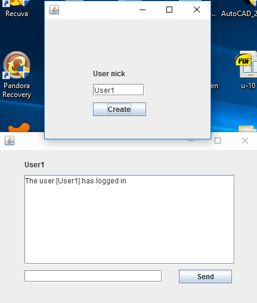
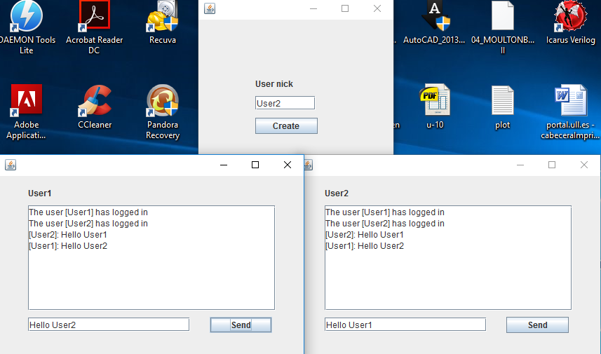

# Java Chat Room
## Mauricio José Orta Rodríguez

  A simple offline local chat room simulator made on Java.
  
  The app starts with a window to create the users chat windows. Then, messages can be sent by each each window and they will be displayed to
  all the users.
  
##Screenshots 

  
  
  

